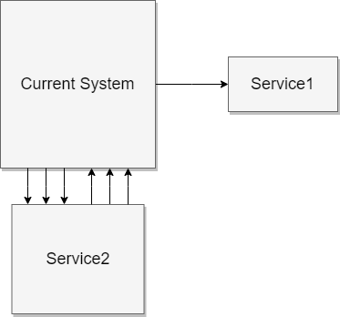
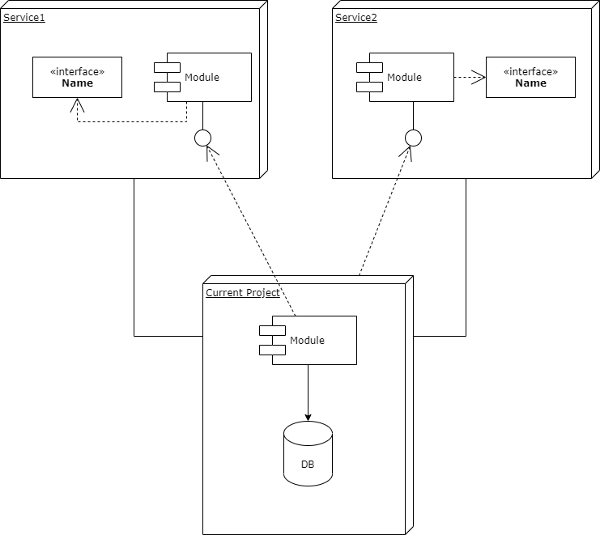

# PROJECT-NAME

Table of contents:
- [Introduction](#introduction)
- [Functional view](#functional-view)
- [Architecture overview](#architecture-overview)
- [Deployment view](#deployment-view)

## Introduction
General description of a project.

## Functional view

### Stakeholders / Contact people

| Stakeholder type            | Description (Responsibility description) | Stakeholder (First name & lastname) | Contact (email/phone number) |
|-----------------------------|------------------------------------------|-------------------------------------|------------------------------|
| Product owner               | Manage the product                       |||
| Business                    | Requirement provider                     |||
| Subject Matter Expert (SME) | Provide the knowledge and expertise      |||
| Software development        | Maintenance & new features development   |||

### Functional requirements
- FunctionalRequirement1
- FunctionalRequirement2
- FunctionalRequirement3

## Architecture overview

### Context view

### Services

- Service1
    - Purpose
        - Service1 purpose and responsibility
    - Contact people
        - Name Surname (email: example@mail.com)
    - Reference links
        - Swagger (API specification) - https://example.com/swagger-ui.html
        - Service1 documentation - https://wiki.service1.com
- Service2
    - Purpose
        - Service2 purpose and responsibility
    - Contact people
        - Name Surname (email: example@mail.com)
    - Reference links
        - Swagger (API specification) - https://example.com/swagger-ui.html
        - Service2 documentation - https://wiki.service1.com
    
### Performance and scalability

- Service1
    - Data range: X-Y
    - Number of calls per day: Z
- Service2
    - Data range: X-Y
    - Number of calls per day: Z
- Database (estimation)
    - Yearly data increment: X MB
    - Read: ~100 000 per year
    - Write: ~50 000 per year
- Users
    - currently: X
    - in the future: Y
    
## Deployment view

### Build inventory

| Component              | Type of change                         | Description of Change                         | Complexity |
|------------------------|----------------------------------------|-----------------------------------------------|------------|
| Current Project        | New                                    | Create a new service                          | High       |
| DB                     | New                                    | A new database and schema for Current Project | Low        |
| Network infrastructure | Reuse                                  | Reuse an existing setup                       | Low        |
| Software development   | Maintenance & new features development |||

### Network addresses

| Environment | URL                         |
|-------------|-----------------------------|
| Prod        | https://example.com         |
| Pre-prod    | https://preprod.example.com |
| Test        | https://test.example.com    |
| Dev         | https://dev.example.com     |

### Logging
Splunk/Kibana/Other tools

| Environment | URL                         |
|-------------|-----------------------------|
| Prod        | https://example.com         |
| Pre-prod    | https://preprod.example.com |
| Test        | https://test.example.com    |
| Dev         | https://dev.example.com     |

### Monitoring
AppDynamics/Grafana/Other tool

| Environment | URL                         |
|-------------|-----------------------------|
| Prod        | https://example.com         |
| Pre-prod    | https://preprod.example.com |
| Test        | https://test.example.com    |
| Dev         | https://dev.example.com     |

### Service accounts / External accounts

#### Service1

| Environment | Configuration                | Remarks                     |
|-------------|------------------------------|-----------------------------|
| Prod        | https://service1.com         | Check the config repository |
| Pre-prod    | https://preprod.service1.com | Check the config repository |
| Test        | https://test.service1.com    | Check the config repository |
| Dev         | https://dev.service1.com     | Check the config repository |

#### Service2

| Environment | Configuration                | Remarks                     |
|-------------|------------------------------|-----------------------------|
| Prod        | https://service2.com         | Check the config repository |
| Pre-prod    | https://preprod.service2.com | Check the config repository |
| Test        | https://test.service2.com    | Check the config repository |
| Dev         | https://dev.service2.com     | Check the config repository |

### Security

- JWT token validation
- Two-wat TLS
- IP whitelisting (restrict visibility)

### Database

| Env.     | Connection string        | Credentials                  | DNS cnames  |
|----------|--------------------------|------------------------------|-------------|
| Prod     | jdbc:oracle:thin@example | Check the config repository  | example.com |
| Pre-prod | jdbc:oracle:thin@example | Check the config repository  | example.com |
| Test     | jdbc:oracle:thin@example | username: xxxx password: zzz | example.com |
| Dev      | jdbc:oracle:thin@example | username: xxxx password: zzz | example.com |

### Additional configuration

- Config repository
    - https://example.config.repo.com
